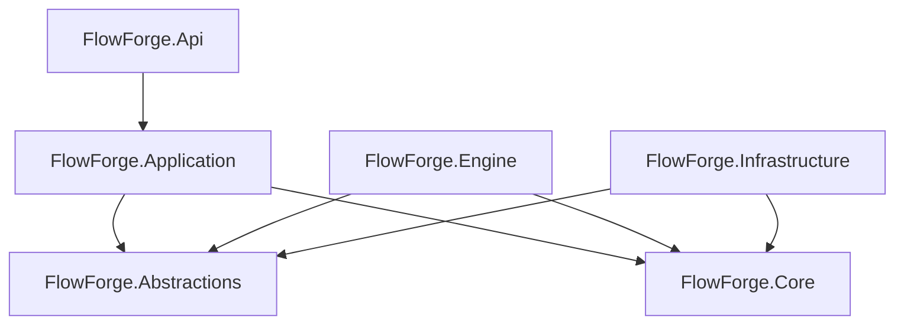

# FlowForge

A modular workflow orchestration platform built with .NET.

## Overview

FlowForge is a workflow orchestration platform for defining, executing, monitoring, and managing workflows. It uses a layered architecture to separate domain models, application use cases, execution orchestration, infrastructure adapters, and API concerns.

## Features

### Workflow Runtime

- Workflow definition management
- Versioned workflow definitions
- Graph-based execution model
- Node execution lifecycle
- Execution history tracking
- Correlation-aware execution flow

### Trigger System

- Manual triggers
- Scheduled triggers
- Event triggers

### Persistence

- Provider-independent persistence abstractions
- In-memory implementations for testing
- PostgreSQL persistence support
- Execution state storage
- Workflow definition storage

### API Platform

- REST API
- Versioned API routes
- Standardized error responses
- Correlation identifiers
- Health endpoint
- Runtime diagnostics

### Security

- Security context abstraction
- JWT authentication foundation
- Claims mapping
- Permission-based authorization foundation

### Operations

- Structured request logging
- Runtime metrics foundation
- Health checks
- Docker packaging
- GitHub Actions CI pipeline

## Architecture



## Project Responsibilities

| Project | Responsibility |
| --- | --- |
| `FlowForge.Core` | Domain models and business rules. |
| `FlowForge.Abstractions` | Provider-independent contracts and interfaces. |
| `FlowForge.Application` | Application use cases and service boundaries. |
| `FlowForge.Engine` | Workflow execution and orchestration. |
| `FlowForge.Infrastructure` | Persistence and external integration adapters. |
| `FlowForge.Api` | HTTP API and hosting boundary. |

## Technology Stack

- .NET 10
- ASP.NET Core
- PostgreSQL
- Dapper
- xUnit
- GitHub Actions
- Docker

## Getting Started

Build the solution:

```shell
dotnet build FlowForge.slnx
```

Run the test suite:

```shell
dotnet test FlowForge.slnx
```

## Configuration

FlowForge uses ASP.NET Core configuration providers. Important environment variables include:

```text
FlowForge__Database__ConnectionString
FlowForge__Security__Authority
FlowForge__Security__Audience
FlowForge__Security__RequireAuthentication
```

Production credentials should be supplied through environment variables or secure configuration providers.

## Docker

Build the API image:

```shell
docker build -t flowforge-api ./src/FlowForge.Api
```

Run the API container:

```shell
docker run -p 8080:8080 flowforge-api
```

Health endpoint:

```text
GET /health
```

## CI/CD

The GitHub Actions pipeline runs on pushes and pull requests. It restores dependencies, builds the solution, runs the complete test suite, executes PostgreSQL integration tests, and publishes test results.

## Current Status

FlowForge has completed its platform foundation milestone:

- Workflow runtime
- Versioned definitions
- Trigger runtime
- PostgreSQL persistence
- Execution history
- Diagnostics
- API platform
- Security foundation
- Observability foundation
- Docker packaging
- CI/CD pipeline

## Roadmap

- Multi-tenancy foundation
- Workflow ownership
- Advanced authorization model
- Enterprise audit capabilities
- Additional runtime capabilities

## License

This project is currently not licensed for external use.
